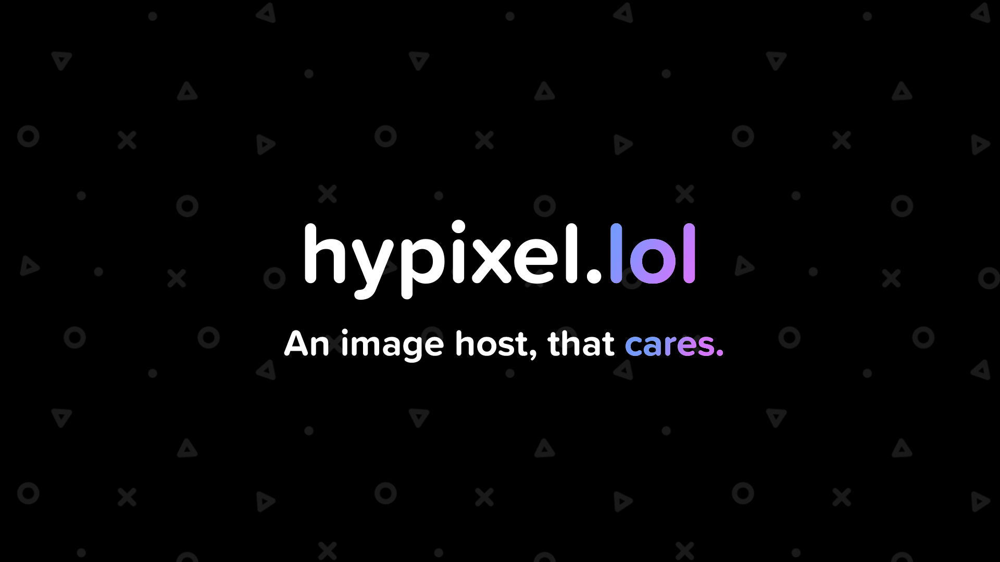

# hypixel.lol


> [!CAUTION]
> hypixel.lol **has officially been closed**. No support provided anymore! However, an exciting completely reworked version of the project is in the works!

### Features
- Easy configuration [(Image)](/preview/config.png)
- Automatic config generation for each user [(Image)](/preview/key.png)
- Discord webhooks support [(Image)](/preview/webhook.png)
- A user-friendly dashboard with Discord login integration [(Image)](/preview/user.png)
- Domain management from the dashboard without any hassle [(Image)](/preview/domains.png)

### Installation
- Download / Clone the source code.
- Run `npm i` to install the packages.
- After installing you can use the provided setup by typing `node setup.js` to the console. (You can enter the data manually to the file too)
- Run `node .` or `npm start` to start the node.

### Installation (Linux)
For Linux systems everything is automated with the bash script, all you need to do:
- Make the script executable with `chmod +x install.sh`
- And running it with `./install.sh`

### Config
Here is a list of all the keys in the config with their meaning.  

- `maindomain` : This is the main domain, if a domain is not set in the config it falls back to this.  
- `uploadkeylength` : The length of characters, that are after the username in the upload key.  
- `nodeserverport` : The port for the server.
- `upload_notify` : Get a console log about every upload.
- `webhook_notify` : Get a Discord webhook log about every upload.
- `webhook_url` : The URL for the webhook.

### Progress
- [X] Page rendering cleanup
- [X] Webhooks for uploads
- [X] Endpoints cleanup
- [X] Complete user system with Dashboard
- [X] Embed support

### How to make new endpoints
To make a new endpoint you need to make a file in the `routes` folder with your name of choice. Example: `example.js`
The empty version should look like this:
```js
const express=require('express')
const router=express.Router()
router.get("/",(req,res)=>{
    res.send('Hello!')
})
module.exports=router;
```

Then you just need to add a new value to the `"routes.json"` array:
```json
{
        "endpoint": "/yourendpoint",
        "location": "./routes/yourfile"
}
```

**Note!**
In your endpoint JS file, leave the router endpoint on `"/"`, since you will be giving the name of the route in the main `server.js` file.

### How to setup Discord Login
- Make an application on the [Discord Developer Page](https://discord.com/developers/applications)
- Go to the `OAuth2` Tab
- Copy the `Client ID` and the `Client Secret`, and paste them to the `.env.sample` file in the root folder.
- NOTE!! Rename `.env.sample` to `.env` for it to work.
- Make a redirect URL, that matches the route with the one, in the config

```
DC_URL="http://localhost/login/callback"
```


### How to add new folders to check
To add new folders to the checker, you simply add a new list element containing the path of the folder in the `folders` variable in the `server.js` file. The checker (`/functions/check.js`) will run through all the list items, and checking them, if they exist, if they don't exist, it will make the specified folder.

### API
- **GET** `/api/uploads/:uploadkey` : Returns a list of uploads uploaded with the upload key.
- **GET** `/api/domains` : Returns a list of all the domains.
- **POST** `/api/upload`: This is the upload URL, and you can use other apps to upload files. In the post body you only need the `upload-key` and the `file`.

### Copyright
hypixel.lol is solely owned and developed by [Benny](https://github.com/bentettmar). All rights go towards the developers.
